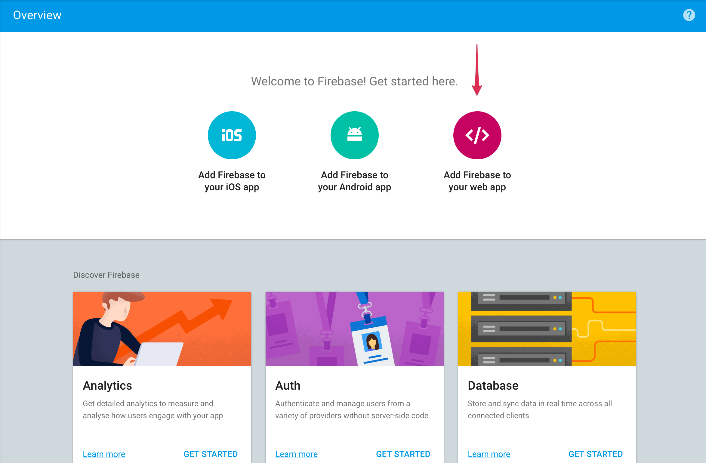
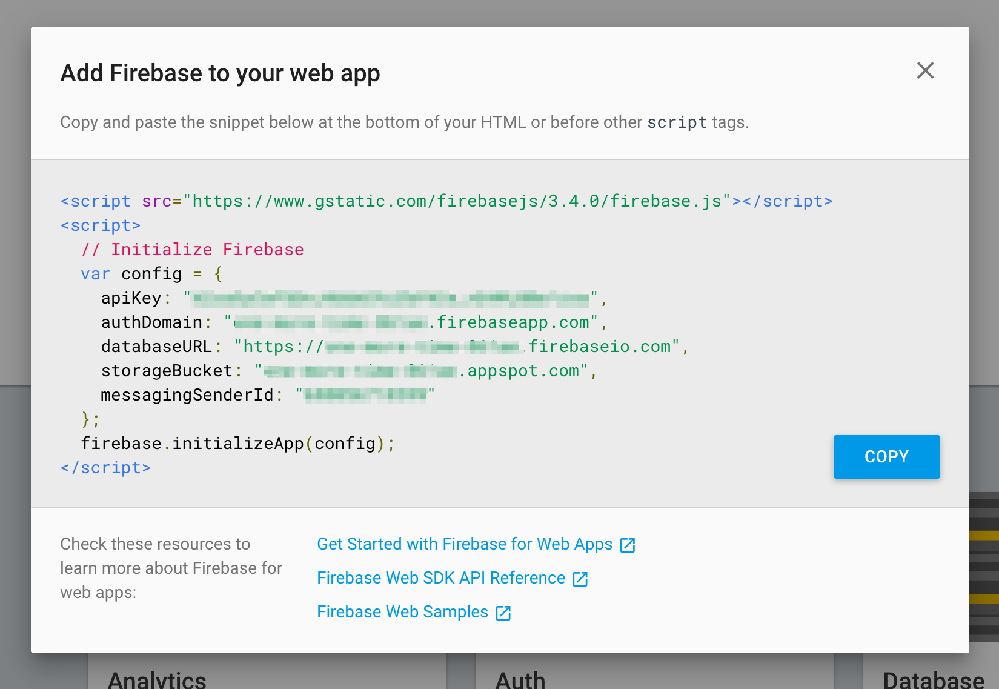
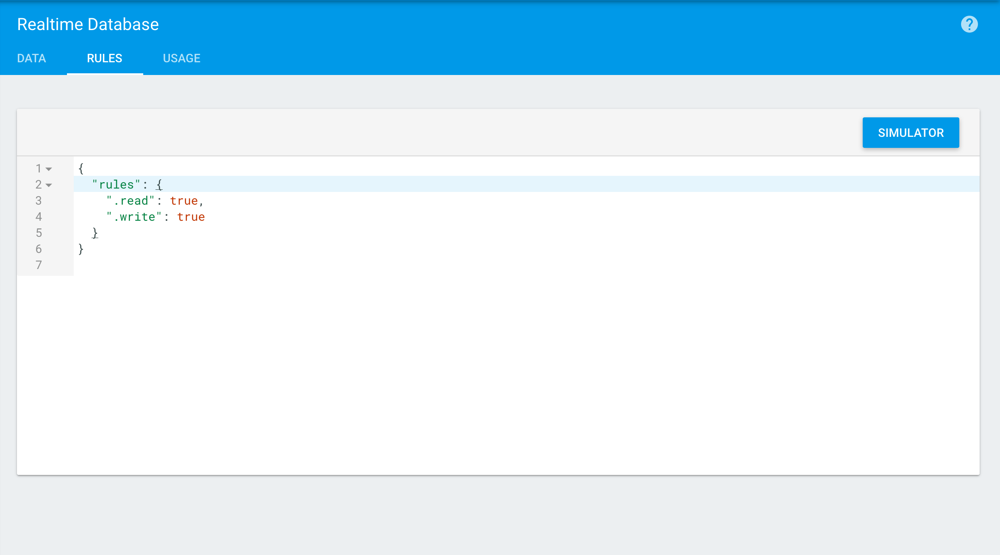

# Lesson 19 - Firebase

## Recap & Intro
- We've learned a lot about React
- Last lesson, we learned how to get data into our React components
- Today we'll learn how to integrate a real-time data source
- We'll also learn how to deploy our application

## What is Firebase
Firebase is a back end as a service (BaaS) platform. It provides:

- Hosting for your static application
- Data read/write
- User Authentication 

## Hosting
Your React app is static, meaning that it doesn't have to run any code on the server. All a server needs to do is host your files and provide them to a client when requested. Firebase does this for you easily.

## Vanilla Install

First, Let's go ahead and configure firebase

### Initial Firebase Config

- Sign up using your google account at the [firebase.io](http://www.firebase.io)
- create an application from the firebase dashboard
	- take note of the ID generated for your project
	- this can be found in several places, however, the URL is the best place to look
		- your project ID is found directly after `/project/`
		- `https://console.firebase.google.com/project/YOUR-PROJECT-NAME-HERE/overview`
- install the firebase CLI from the command line `npm install -g firebase-tools`
- login `firebase login`
- Create a project directory from the terminal <br>*note: don't forget to `cd` into the new directory*
- initialize the project `firebase init`
	- select your project name from the list (using the project ID from above)
- Go back to the [Firebase Console](https://console.firebase.google.com/) in your browser
	- Locate your Application
	- Select the Option for Adding Firebase to your **Web App**<br>
	-  Copy the code snippet <br> 
	-  paste the code snippet into the `<body>` of your `index.html` file (updating it with your own API credentials)<br>
	
		```html
		<body>
			<div id="message"></div>
			   	 	
			<script src="https://www.gstatic.com/firebasejs/3.4.0/firebase.js"></script>
			   	 	
			<script>
			  var config = {
		   	  	apiKey: "<API_KEY>",
		     	authDomain: "<PROJECT_ID>.firebaseapp.com",
				databaseURL: "https://<DATABASE_NAME>.firebaseio.com",
		    	storageBucket: "<BUCKET>.appspot.com",
		  	  };
			 </script>
		</body>
		```
		
Now we are ready to start working with Firebase 		  
- - - -


## Data

A Firebase data store can be thought of simply as a JSON object in the cloud.<br> When you create a Firebase application, a URL is created that represents the root node of the JSON object. 

### Reading Simple Data
Because Firebase is real-time, you don't request data in a discrete way like you do from a REST API. Instead, you listen for events on your data that signal when the data has been updated and run a callback when that happens. 

For example, we can run a callback function every time our JSON object is changed

```javascript
dbRef.on("value", function(snapshot) {
  console.log(snapshot.val());
})
```

*Note - Events are fired immediately for existing data.*

So, how does this work?

below `firebase.initializeApp(config);` put the following code:

```javascript
// <script> 
// ... 

var message = document.getElementById('message');
var dbRef = firebase.database().ref().child('message');
    
dbRef.on('value', (snapshot) => message.innerText = snapshot.val())

// </script>
// ...
```

There are several things going on in the above code, so let's break it down. 

- We are storing the div with an ID of message in a variable
- We are creating a variable named dbRef
	-  `firebase.database()` connects to the firebase real-time database associated with our app
	-  `.ref()` represents a specific location in your database... used for reading/writing data to that location.
	-  `child()` gets a Reference for the location at the specified path. <br> in our case, we will call this 'message' (*more on this later)*
	-  `on()` is an *event listener* that listens for data changes at a specific location 
		- `on()` takes up to 4 arguments `on(eventType, callback, cancelCallbackOrContext, context)`
		- in this case...
			- the eventType is value (listen for a change to the value)
			- our callback function returns a **snapshot** from firebase
			- using the **snapshot**, we will update the message div's inner text with the **value** of the snapshot

*note: more regarding `firebase.database` can be found [here](https://firebase.google.com/docs/reference/js/firebase.database.Reference)*

```javascript
var ref = new Firebase("https://tts-demo.firebaseapp.com/");
```

#### Test it out

- Load up your app by running `open public/index.html` from the command line
- Open the Firebase Console (preferably side-by-side with your `index.html` page) 
- Navigate to the **Database** tab (located on the sidebar)
- Click on the *Rules* tab at the top of your Database panel and change read/write to `true`<br> <br> *this allows you to read/write data without authentication, and should only be used in development mode*
- Navigate back to Data tab
- Click the green plus sign and add a message
- Watch your browser load the new message!

 

### Writing Data

We can write data to firebase by using the `set()` method. `set()` takes an object as it's argument.

```javascript
// ...

dbRef.set({
  message: 'hello world'
});
```


The example above replaces the data completely. Instead, you can provide an object with a partial set of keys to update.

```javascript
firebase.initializeApp(config);

    var message = document.getElementById('message');
    var dbRef = firebase.database().ref()

    dbRef.on('value',(snapshot) => message.innerText = JSON.stringify(snapshot.val()))

    dbRef.set({
      className: 'JS',
      weeks: 10
    });

    dbRef.update({
      className: 'JS Application Development',
      students: 15
    });


/* Ref is now
{
  className: 'JS Applications',
  weeks: 10,
  students: 15
}
*/

```


### Child References
Most times, you don't want to listen to the whole JSON object, just a specific subsection. You can create a reference to a portion of your JSON object by using the reference's `child()` function.

Let's say your data looks like this:

```javascript
{
	{
      class: 'JS Applications',
  		name: 'Shane',
  		computer: {
  			type: 'mac',
  			size: '15 inch'
  	}	  
}
```

You can read and listen for changes in just the `teacher` object by creating a child reference like this:

```javascript
  var teacher = dbRef.child('teacher');

    teacher.on('value',(snapshot) => message.innerText = JSON.stringify(snapshot.val()))

    teacher.set({
      class: 'JS Applications',
  		name: 'Shane',
  		computer: {
  			type: 'mac',
  			size: '15 inch'
  		}
	  })
```

Child paths can be nested as deeply as you'd like.

```javascript
var ShanesComputer = dbRef.child('teacher/computer');
```

## Exercise 1 

Using the instructions from [Initial Firebase Config]() 

- Create a new basic application 
- Hook Up Firebase
- Create a form with:
	- 1 input
	- 1 button
- when the button is clicked update Firebase

#### Extra Credit

- Append the new items to the screen in an unordered list


## Exercise 1 Answer

```html
  <form>
    <input type="text" id="message"/>
    <button id="btn"> Add </button>
  </form>
```

```javascript
var message = document.getElementById('message');
    var dbRef = firebase.database().ref()
    var newMessage = dbRef.child('newMessage')

    document.getElementById('btn').addEventListener('click', function(e){
      newMessage.set({
        message: message.value
      })
	 })
```

## Firebase with React
Let's add Firebase data to a React component. Let's start with a simple controlled component.

```javascript
import React, { Component } from 'react';
import './App.css';

class App extends Component {
  constructor() {
    super();
    this.state = {
      inputValue: ''
    }
  }

  _handleChange = (event) => {
    this.setState({
      inputValue: event.target.value
    })
  }

  render() {
  
    return (
      <div>      
        <input value={this.state.inputValue} onChange={this._handleChange} />
      </div>
    )
  }
}

export default App;
```

#### Install Firebase
Next, we'll bring in Firebase via npm `npm install --save firebase`. We can now import firebase just like all of our other dependencies

```javascript
import React from 'react';
import ReactDOM from 'react-dom';
import classNames from 'classnames';

//Import firebase!
import * as firebase from 'firebase';

//...
```

<!--#### Create a ref
For now, let's have our component create a firebase reference.

```javascript
  constructor() {
    super();
    
    this.state = {
      inputValue: ''
    }
    
    this.ref = new Firebase("https://tts-demo.firebaseapp.com/");
  }
```-->

#### Initialize Firebase

Before we get started with reading/writing realtime data, we'll need to add our Firebase config.

In `src/index.js` add your firebase config

```javascript
import React from 'react';
import ReactDOM from 'react-dom';
import App from './App';
import './index.css';
import * as firebase from 'firebase';

const config = {
		   	  	apiKey: "<API_KEY>",
		     	authDomain: "<PROJECT_ID>.firebaseapp.com",
				databaseURL: "https://<DATABASE_NAME>.firebaseio.com",
		    	storageBucket: "<BUCKET>.appspot.com",
		    	messagingSenderId: "688056718599"

}

firebase.initializeApp(config);

ReactDOM.render(
  <App}/>,
  document.getElementById('root')
);
```

#### Add dbRef as a prop

Due to the fact our reference to the Database should be immutable, Add dbRef as a prop

```javascript
ReactDOM.render(
  <App dbRef={firebase.database().ref().child('App')}/>,
  document.getElementById('root')
);
```

#### Get Data from Firebase
We can bring in data from Firebase in the `componentDidMount` event.

```javascript
componentDidMount(){

this.setState
	this.props.dbRef.on("value", (snapshot) => {
	  this.setState({
	  	inputValue: snapshot.val()
	  })
	})
}
```
This creates a 1-way data binding from firebase to the component. That is, every time Firebase is updated, the component's state will be updated.

#### Update data in Firebase
If we want updates to be saved to firebase, we'll have to update our reference object.

```javascript
  _handleChange = (event) => {
      this.setState({
        newMessageInput: event.target.value
      })
  }
```

Notice that this.setState() isn't necessary! This is because your callback in componentDidMount will set update the component state for you.

**Note - Your data is being updated in real time. Open another browser to the same local address and watch the magic happen**
 
## Exercise 2: Binding data
Let's create a theme preview tool with React

- Create a form with controlled text inputs for color and background
- Create a 'save' button
- Create a div (500px by 500px) with an h1 that reads 'This is a preview'
- When the 'save' button is clicked, save the two values currently in the inputs to a firebase reference
- Style the div to display the text color and background color stored in Firebase at all times
- Set up the inputs to contain the names of the text and background colors saved in firebase.


## Lists of data
One thing we haven't covered yet, is how to deal with arrays or lists with firebase. This is very similar to how we deal with other data, but with different events. We'll be using `ref.push(obj)` to write data and `child_added`, `child_removed` and `child_changed` events to read updated data


## Chat app

Let's build a chat app similar to what you've been building through the class challenges :) 


<!--We'll start with our basic, one component, message app:

```javascript
import React from 'react';
import ReactDOM from 'react-dom';
import classNames from 'classnames';

class MessageApp extends React.Component {
  constructor() {
    super();
    this.state = {
      newMessageInput: '',
      messages: []
    }
  }

  _handleButton(event) {
    var newMessage = this.refs.messageInput.value;
    this.setState({
      messages: this.state.messages.concat(newMessage)
    })
  }

  _handleChange(event) {
    this.setState({
      newMessageInput: event.target.value
    })
  }

  render() {
    var messages = this.state.messages.map((message, i)=>{
      return <li key={i}>{message}</li>
    })

    return (
      <div>
        <h1>Slick</h1>
        <input ref="messageInput" value={this.state.newMessageInput} onChange={this._handleChange.bind(this)} />
        <button onClick={this._handleButton.bind(this)}>Submit</button>
        <ul>
          {messages}
        </ul>
      </div>
    )
  }
}

var mountPoint = document.querySelector("#app");
ReactDOM.render(<MessageApp />,mountPoint)
```

We're going to want to read and write the state.messages array from Firebase following the same steps are before:

#### Import firebase 
`import Firebase from 'firebase';`

#### Create a reference to messages
```javascript
constructor() {
   super();
    this.state = {
      newMessageInput: '',
      messages: ['hello', 'world']
    }

  	this.messagesRef = new Firebase("https://tts-demo.firebaseapp.com/messages");
}
```

#### Get data in componentDidMount using 'child_added' event

```javascript
componentDidMount(){
  	this.messagesRef.on("child_added", (snapshot) => {
  	  this.setState({
  	  	messages: this.state.messages.concat(snapshot.val())
  	  })
    })
  }
```

#### Push new messages in the _buttonHandle function-->

```javascript
_handleButton(event) {
	this.messagesRef.push(this.refs.messageInput.value)
}
```
```javascript
class App extends Component {
  constructor() {
    super()
    this.state = {
      newMessageInput: '',
      messages: [],
    }
  }

  _handleButton = (event) => {
    const messages = this.props.dbRef.child('messages')
    let newMessage = this.state.newMessageInput

    messages.push(newMessage)

  }

  _handleChange = (event) => {
      this.setState({
        newMessageInput: event.target.value
      })
  }

  componentDidMount = () => {
    const messages = this.props.dbRef.child('messages')

    messages.on('child_added', (snapshot) => {
     this._handleMessages(snapshot, snapshot.key, 'add')
   })

    messages.on('child_changed', (snapshot) =>  this._handleMessages(snapshot, snapshot.key, 'change'))

    messages.on('child_removed', (snapshot) =>  this._handleMessages(snapshot, snapshot.key, 'remove'))

  }

  _handleMessages = (snap, fbKey, action) => {

    let messages = this.state.messages.slice()
    let msg = {}
    msg[fbKey] = snap.val()

    if (action === 'change'){
      console.log('hi');
      let selected = messages.filter((message) => {
        for(var key in message) {
          return key === fbKey
        }
      })
      messages.splice(messages.indexOf(selected[0]), 1)
      messages.push(msg)
    } else if (action ==='remove') {
      let selected = messages.filter((message) => {
        for(var key in message) {
          return key === fbKey
        }
      })
      messages.splice(messages.indexOf(selected[0]), 1)

    } else {
      msg[fbKey] = snap.val()
      messages.push(msg)
    }

    this.setState({
                    newMessageInput: '',
                    messages
                  })
  }

  render() {
    let messages = this.state.messages.map((message, i)=>{
      for(var key in message) {
          var value = message[key];
}
      return <li key={i}>{value}</li>
    })

    return (
      <div>
        <h1>Slick</h1>
        <input  value={this.state.newMessageInput} onChange={this._handleChange} />
        <button onClick={this._handleButton}>Submit</button>
        <ul>
          {messages}
        </ul>
      </div>
    )
  }
}
```

## Exercise 3 + Homework
Write a persistant chat app with React + Firebase.

- Create a login page where the user enters their name
- Validate that the name is more than 1 character and show error otherwise
- Upon login show all previously written messages along with
	- Username
	- Message
	- Time
- Let users enter new messages and show them in real time
- Read about firebase Authentication - https://www.firebase.com/docs/web/guide/user-auth.html
- Implement user authentication using email and password
- Style the app to your heart's content
- Deploy your app to firebase and send us a link in slack

